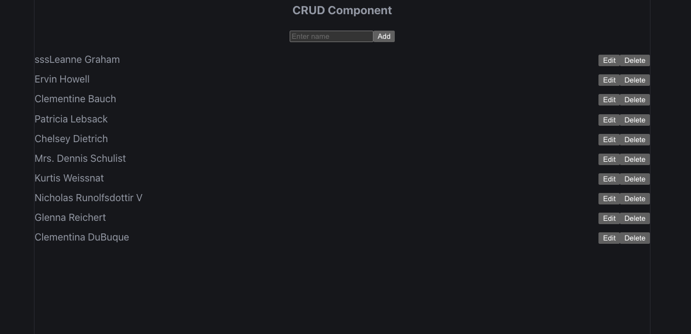

# React CRUD App

A simple React CRUD application using:
- React
- fetch API
- async/await
- JSONPlaceholder API

## Features
✅ Get Users  
✅ Add User  
✅ Update User  
✅ Delete User  

## API Used
https://jsonplaceholder.typicode.com/users

## Technologies
- React
- JavaScript
- Fetch API
- CSS

## Project Structure
src/
 ├── App.jsx
 ├── main.jsx
 ├── components/
 └── styles/
```

